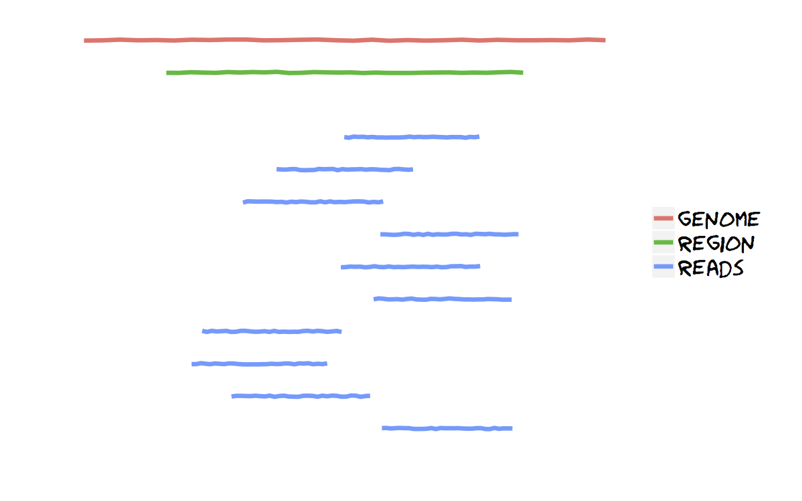
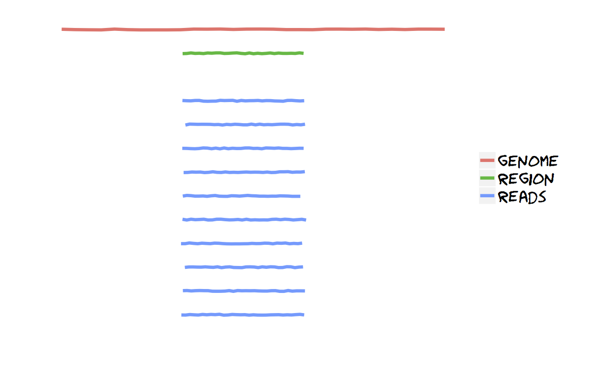

### Generally speaking
Two kinds of local analysis are possible, one invoked by the program `dec.py`,
the other by `amplian.py`. We will define these two as shotgun mode (albeit
improperly) and amplicon mode. The input is always a [sorted bam
file](input.html).

#### Shotgun mode: region longer than the reads

This is performed when the amplicon is longer than the typical read length and
we don't want to focus our analysis on a specific region of this amplicon.
`dec.py` cuts on the aligment a set of overlapping regions (parameters can be
adjusted, run `dec.py -h` for help), and passes them to `diri_sampler` for error
correction and local haplotype reconstruction. This is the first step of the
[global analysis](global.html). Additionally, it runs `snv.py` for SNV calling.

#### Amplicon mode: region covered by a single read

When the amplicon size is smaller than the read length or comparable to it, it
is in general more appropriate to use `amplian.py`, which extracts the multiple
alignment corresponding to the specified amplicon. By default, this includes
reads that cover at least 95% of the amplicon region (this can be adjusted
with the option `-m MIN_OVERLAP`). It then runs `diri_sampler` for error
correction and `snv.py` for SNV calling.

### Examples
#### Shotgun mode: `dec.py`
Run `dec.py -h` for help.

    [user@host]$ dec.py -h
    Usage: dec.py [options]
    Options:
    -h, --help   show this help message and exit
    -b IN_BAM, --bam=IN_BAM   file with aligned reads in .bam format
    -f IN_FASTA, --fasta=IN_FASTA   reference genome in fasta format
    . . . more options . . .
You should specify the window size (default is 201), add the `-k` flag
if you want to save intermediate files (for example, to check the
convergence of the Markov chain). Next line runs with a window length of 300
and keeps intermediate files. `ref_file.fasta` contains the reference sequence
that has been used to align reads.

    [user@host]$ dec.py -b my_sorted_bam.bam -f ref_file.fasta -w 300 -k

#### Amplicon mode: `amplian.py`
As usual, the help is available with `-h`.

    [user@host]$ amplian.py -b my_sorted_bam.bam -f amplicon.fasta -m 0.95

`amplian.py` uses the option `-m` to specify minimum overlap that the reads
are required to have with the amplicon in order to be included (default 95%).
The file `amplicon.fasta` contains the amplicon sequence used to align reads,
which should be slightly smaller than the typical read length.

### Output of local analysis
#### Shotgun mode
Suppose we are analyzing a region of 1500 bp, and we chose window size of 300.
By default, windows overlap such that (except for the boundaries of the region)
each base is covered by three windows (option `-s`). So `dec.py` will produce
windows 1-300, 101-400, 201-500, 301-600 and so on. All these are passed to
`diri_sampler` and local haplotype are inferred. For each window there will
be several files produced. We describe here two of these, the **support**
and the **sampling** file.

The support file has the `support.fas` suffix. It is a fasta file with the
reconstructed haplotypes. The header of each sequence contains information on
the quality of the reconstruction (posterior probability of the haplotype) and
the frequency of the haplotype. For example,

    >hap_0|posterior=1 ave_reads=235.168
    CCTCAGATCACTCTTTGGCAACGACCCTTCGTC

indicates that the reconstructed haplotype has a posterior probability of 1 (it
was always present in the sampled Markov chain) and on average 235 reads were
assigned to it. Good results have been obtained by discarding haplotypes with
less than 90-95% support.

`snv.py` takes care of parsing the single nucleotide variants, check the strand
bias and write a CSV file with all the information (suffix `final.csv`) in the
directory `snv`.

#### Amplicon mode
`amplian.py` will analyse a single window, corresponding to the reference
sequence passed with the option `-f`. Consequently, the output files from the
support to the SNV file will refer to this single window (see shotgun mode
above).

---

Go back [home](index.html)
